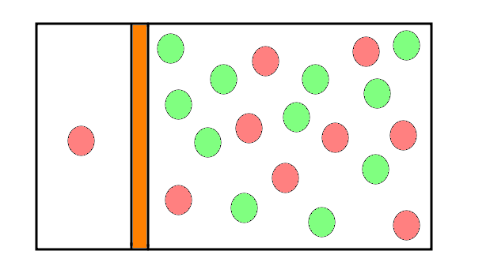
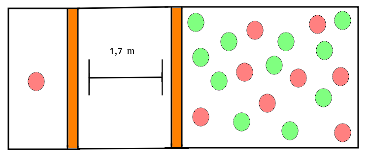
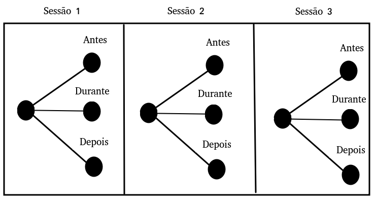

```{r, include = FALSE}
source("./config/setup.R")
```

# Introdução

## Estudos de comportamento animal

 - O \textbf{comportamento de um animal} reflete seu \textbf{estado emocionais}.
 
 - Estudos de comportamento animal forneceram informações úteis sobre o bem-estar animal em uma ampla variedade de situações.

 - Tais estudos costumam produzir \textbf{dados complexos} e \textbf{não estruturados}, registrados a partir de áudios, imagens e vídeos, entre outros.

 - Estes dados não estruturados, quando tratados, são fontes de \textbf{diversas variáveis aleatórias}.
 
## Estudos de comportamento animal

Por exemplo: 

 - Considere que a movimentação de cabeça de um animal em contato com um ser humano reflete algum estado emocional.

 - Para avaliar a movimentação de cabeça podemos:

      1. Verificar se cada animal apresentou ou não o comportamento específico, configurando um \textbf{resultado binário}. 

      2. Avaliar o número de vezes que o comportamento foi repetido, gerando uma \textbf{variável de contagem}. 

      3. Avaliar a proporção do tempo em que o animal realizou o movimento, gerando uma \textbf{variável contínua}. 

      4. Registrar o tempo até a ocorrência de um evento, gerando um \textbf{dado censurado}. 

## Estudos de comportamento animal

 - Estudos de comportamento animal costumam apresentar diversos outros fatores que devem ser levados em consideração na análise estatística. 

\beginAHalfColumn

  - Unidades agrupadas (ninhadas, rebanhos). 

  - Estudos longitudinais (cada animal é avaliado em diferentes momentos).

  - Estudos espaciais (coordenadas espaciais são relevantes para a análise).

\endColumns
\beginAHalfColumn

  - Relações não lineares.
      
  - Heterocedasticidade.
      
  - Assimetria e/ou curtose.
      
  - Super ou subdispersão.
      
  - Inflação zeros.

\endColumns

## Modelos de regressão

\beginAHalfColumn

 - Devido a estas características a análise estatística de dados de comportamento animal requer \textbf{modelos flexíveis}, capazes de lidar com as características dos dados.
 
 - Em geral, são usados \textbf{modelos de regressão}.

\endColumns
\beginAHalfColumn


\endColumns

## Modelos de regressão

 - \textbf{Fenômeno aleatório}: situação na qual diferentes observações podem fornecer diferentes desfechos. 
  
 - \textbf{Variáveis aleatórias}: mecanismos que associam um valor numérico a cada desfecho possível do fenômeno. 
  
 - \textbf{Distribuições de probabilidade}: modelos probabilísticos que buscam descrever as probabilidades de variáveis aleatórias.

## Modelos de regressão

 - Na prática, podemos buscar uma \textbf{distribuição de probabilidades} que melhor descreva o fenômeno de interesse. 
  
 - Estas \textbf{distribuições} são descritas por \textbf{funções}. 
  
 - Estas funções possuem \textbf{parâmetros} que controlam aspectos da distribuição.
  
 - Os parâmetros são \textbf{quantidades desconhecidas, estimadas} por meio dos dados.

## Modelos de regressão

 - Em regressão \textbf{modelamos parâmetros} das distribuições como uma função de \textbf{variáveis explicativas}.
  
 - O parâmetro de interesse é decomposto em uma combinação linear de novos parâmetros que associam as \textbf{variáveis explicativas} à \textbf{variável resposta}.
  
 - Obtém-se uma \textbf{equação que explique a relação} entre as variáveis. 
 
## Modelos de regressão

```{r, echo = FALSE, out.width = "11cm"}
knitr::include_graphics("./img/modelos_regressao.pdf")
```

## Modelos de regressão

 1. \textbf{Definição do problema.}
    - Qual o fenômeno aleatório de interesse?
    - Que fatores externos podem afetar este fenômeno?

 2. \textbf{Análise dos dados via regressão.}
    - Distribuição de probabilidade.
    - Especificação do modelo.
    - Obtenção dos parâmetros (ajuste).
    - Diagnóstico.
      
 3. \textbf{Interpretação dos resultados.}
    - Quais os fatores externos apresentam ou não impacto sobre o fenômeno.
    - Qual a dimensão desse impacto.
    
## GAMLSS

 - GAMLSS: \textbf{generalized additive models for location, scale and shape}.

 - É um \textbf{framework} para ajuste de modelos de regressão. 

 - Dispõe de um grande conjunto de \textbf{distribuições}.

 - Permite modelar cada parâmetro de distribuição incluindo \textbf{covariáveis}, \textbf{efeitos aleatórios} e \textbf{suavizadores}. 

## GAMLSS

 - Desta forma, várias das restrições relacionadas aos dados de comportamento animal podem ser adequadamente tratadas.
 
  - Os \textbf{efeitos aleatórios} são uma ferramenta adequada para lidar com dados multiníveis e permitem acomodar adequadamente a \textbf{estrutura de correlação} resultante de projetos de medidas repetidas. 
  
  - Os \textbf{suavizadores} são úteis na modelagem de \textbf{relacionamentos não lineares} entre os parâmetros de distribuição e as covariáveis contínuas.
  
## Pontos vistos até aqui

\beginAHalfColumn

 - Dados de comportamento animal.
 	- Objetivo.
 	- Tipos de resposta.
 	- Especificidades dos dados.
 	
 - Modelos de regressão.
 	- Ideia geral.
  	- GAMLSS.

\endColumns
\beginAHalfColumn

\endColumns

## Objetivo

 - O estudo teve como objetivo explorar o potencial do \textbf{GAMLSS} na \textbf{análise de comportamento animal}.

 - Os dados que motivaram o estudo é de \textbf{comportamento de ovinos} em que buscou-se avaliar se \textbf{intervenção humana} e \textbf{isolamento social} influenciam o comportamento dos animais.

 - A amostra era composta por \textbf{20 ovinos} pertencentes a \textbf{duas linhagens genéticas} diferentes.
 
## Objetivo

\beginAHalfColumn

 - Dentre as principais informações resultantes deste experimento podemos destacar dois tipos de variáveis: 
	1. O \textbf{número de mudanças} posturais.
	2. A \textbf{proporção} (ou percentual) de tempo que cada postura foi expressa. 

\endColumns
\beginAHalfColumn

 - Uma série de respostas foi observada, como
 	1. Posturas de \textbf{orelha} (levantadas, horizontais e assimétricas). 
 	2. Postura dos \textbf{olhos} (fechados, semicerrados e abertos). 
 	3. Comportamento \textbf{alimentar} (comendo, ruminando, não comendo ou ruminando).

 	entre outros.

\endColumns
 	
## Objetivo

\beginAHalfColumn

 - A título de ilustração, consideramos duas variáveis de tipos distintos: 
	  - O \textbf{número de mudanças} de postura de orelha.
	  - A \textbf{proporção} de tempo realizando a postura de orelha horizontal.

\endColumns
\beginAHalfColumn	

 - Ovelhas submetidas a eventos positivos:
 	  - Apresentam altas proporções de posturas de orelha horizontais.
 	  - Menos alterações de postura de orelha do que ovelhas em situações negativas.

\endColumns


# Estudo de caso

## Estudo de caso

\beginAHalfColumn

 - Foram observadas \textbf{20 ovelhas} pertencentes a \textbf{2 linhagens genéticas}, que foram \textbf{submetidas à escovação} por um humano que lhes era familiar.
 
 - Verificou-se o número de alterações de postura e as proporções de tempo em que os animais permaneciam em determinadas posturas.

\endColumns
\beginAHalfColumn

```{r, echo = FALSE, out.width='70%', fig.align='center', fig.cap="Fotografia dos animais sob análise."}
knitr::include_graphics("./img/animais.png")
```

\endColumns

## Estudo de caso

```{r, echo = FALSE, out.width='55%', fig.align='center', fig.cap="Fotografia dos animais sob análise."}
knitr::include_graphics("./img/animais2.png")
```

## Estudo de caso

O experimento foi conduzido em \textbf{três sessões experimentais}:

 1. Na primeira havia uma grade de metal separando o animal testado dos demais animais, \textbf{sem distância} entre eles.

 2. Na segunda havia duas grades de metal separando o animal testado dos demais animais a uma \textbf{distância de 1,7 m}.
	
 3. Na terceira sessão os animais voltaram a ser separados por apenas uma grade, \textbf{sem distanciamento} dos demais animais.

## Estudo de caso

```{r, echo = FALSE, out.width='70%', fig.align='center', fig.cap="Esquema sessões 1 e 3 (sem isolamento)."}

```

## Estudo de caso

```{r, echo = FALSE, out.width='70%', fig.align='center', fig.cap="Esquema sessão 2 (com isolamento)."}

```

## Estudo de caso

```{r, echo = FALSE, out.width='60%', fig.align='center', fig.cap="Foto sessão."}
knitr::include_graphics("./img/isol.png")
```

## Estudo de caso

Em cada sessão, as ovelhas foram observadas em \textbf{3 momentos} distintos:

 1. Fase de \textbf{pré escovação}, com duração de 2 minutos e 30 segundos.

 2. Fase de \textbf{escovação}, com duração de 3 minutos.

 3. Fase de \textbf{pós escovação}, com duração de 2 minutos e 30 segundos.

## Estudo de caso

```{r, echo = FALSE, out.width='55%', fig.align='center', fig.cap="Fotografia animal sob intervenção humana (escovação)."}
knitr::include_graphics("./img/escov.png")
```

## Estudo de caso

Temos \textbf{3 variáveis categóricas}:

 1. \textbf{Linhagem}: fator de 2 níveis que classifica os animais como reativos (R+) ou não reativos (R-).
 
 2. \textbf{Sessão}: fator de 3 níveis que indica a sessão experimental de acordo com o isolamento social (sessões 1 e 3 sem isolamento, sessão 2 com isolamento).
 
 3. \textbf{Momento}: fator de 3 níveis que indica se o animal está ou não sob intervenção humana (antes, durante ou depois da intervenção).

Temos \textbf{2 respostas} distintas:

 1. Número de mudanças de postura de orelha.
 2. Proporção do tempo com as orelhas em posição neutra.	
	
## Estudo de caso

 - Considerando as combinações entre as variáveis, \textbf{cada animal} contribui com \textbf{9 medidas} ao conjunto de dados.

 - Portanto existe uma estrutura de medidas repetidas.

```{r, echo = FALSE, out.width='55%', fig.align='center', fig.cap="Combinação entre sessão e momento."}

```
