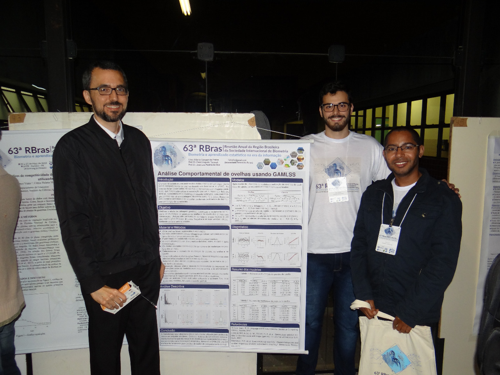

```{r, include = FALSE}
source("./config/setup.R")
```


# Introdução

## Estudos de comportamento animal

 - O \textbf{comportamento de um animal} reflete seu \textbf{estado emocional}.
 
 - Estudos de comportamento animal forneceram informações úteis sobre o bem-estar animal em uma ampla variedade de situações.

 - Tais estudos costumam produzir \textbf{dados complexos} e \textbf{não estruturados}, registrados a partir de áudios, imagens e vídeos, entre outros.

 - Estes dados não estruturados, quando tratados, são fontes de \textbf{diversas variáveis aleatórias}.
 
## Estudos de comportamento animal

Por exemplo: 

 - Considere que a movimentação de cabeça de um animal em contato com um ser humano reflete algum estado emocional.

 - Para avaliar a movimentação de cabeça podemos:

      1. Verificar se cada animal apresentou ou não o comportamento específico, configurando um \textbf{resultado binário}. 

      2. Avaliar o número de vezes que o comportamento foi repetido, gerando uma \textbf{variável de contagem}. 

      3. Avaliar a proporção do tempo em que o animal realizou o movimento, gerando uma \textbf{variável contínua}. 

## Estudos de comportamento animal

 - Estudos de comportamento animal costumam apresentar diversos \textbf{outros fatores} que devem ser levados em consideração na análise estatística. 

\beginAHalfColumn

  - Unidades \textbf{agrupadas} (ninhadas, rebanhos). 

  - Estudos \textbf{longitudinais} (cada animal é avaliado em diferentes momentos).

  - Estudos \textbf{espaciais} (coordenadas espaciais são relevantes para a análise).

\endColumns
\beginAHalfColumn

  - Relações não lineares.
      
  - Heterocedasticidade.
      
  - Assimetria e/ou curtose.
      
  - Super ou subdispersão.
      
  - Inflação zeros.

\endColumns

## Modelos de regressão

\beginAThirdColumn

 - A análise estatística de dados de comportamento animal requer \textbf{modelos flexíveis}.
 
 - Em geral, são usados \textbf{modelos de regressão}.

\endColumns
\beginTwoThirdsColumn

```{r, echo = FALSE, out.width = "11cm"}
knitr::include_graphics("./img/modelos_regressao.pdf")
```

\endColumns

## Modelos de regressão

 1. \textbf{Definição do problema.}
    - Qual o fenômeno aleatório de interesse?
    - Que fatores externos podem afetar este fenômeno?

 2. \textbf{Análise dos dados via regressão.}
    - Distribuição de probabilidade.
    - Especificação do modelo.
    - Obtenção dos parâmetros (ajuste).
    - Diagnóstico.
      
 3. \textbf{Interpretação dos resultados.}
    - Quais os fatores externos apresentam ou não impacto sobre o fenômeno.
    - Qual a dimensão desse impacto.
    
## GAMLSS

 - Existem diversas classes de modelos de regressão, para os mais diversos fins.
 
 - Uma destas classes é o GAMLSS.
 
 - GAMLSS: \textbf{generalized additive models for location, scale and shape}.

 - É um \textbf{framework} para ajuste de modelos de regressão. 

 - Dispõe de um grande conjunto de \textbf{distribuições}.

 - Permite modelar cada parâmetro de distribuição incluindo \textbf{covariáveis}, \textbf{efeitos aleatórios} e \textbf{suavizadores}. 

## GAMLSS

 - Desta forma, várias das restrições relacionadas aos dados de comportamento animal podem ser adequadamente tratadas.
 
  - Os \textbf{efeitos aleatórios} são uma ferramenta adequada para lidar com dados multiníveis e permitem acomodar adequadamente a \textbf{estrutura de correlação} resultante de projetos de medidas repetidas. 
  
  - Os \textbf{suavizadores} são úteis na modelagem de \textbf{relacionamentos não lineares} entre os parâmetros de distribuição e as covariáveis contínuas.
  
## Pontos vistos até aqui

\beginAHalfColumn

\textbf{Dados de comportamento animal}

 - Objetivo.
 - Tipos de resposta.
 - Especificidades dos dados.

\vspace{0.5cm}

\textbf{Modelos de regressão}

 - Ideia geral.
 - GAMLSS.
 - Potencial do GAMLSS para problemas de comportamento animal.

\endColumns
\beginAHalfColumn

\endColumns

## Objetivo

 - O estudo teve como objetivo explorar o potencial do \textbf{GAMLSS} na \textbf{análise de comportamento animal}.

 - Os dados que motivaram o estudo é de \textbf{comportamento de ovinos} em que buscou-se avaliar se \textbf{intervenção humana} e \textbf{isolamento social} influenciam o comportamento dos animais.

 - A amostra era composta por \textbf{20 ovinos} pertencentes a \textbf{duas linhagens genéticas} diferentes.
 
## Objetivo

\beginAHalfColumn

 - Dentre as principais informações resultantes deste experimento podemos destacar dois tipos de variáveis: 
	1. O \textbf{número de mudanças} posturais.
	2. A \textbf{proporção} (ou percentual) de tempo que cada postura foi expressa. 

\endColumns
\beginAHalfColumn

 - Uma série de respostas foi observada, como
 	1. Posturas de \textbf{orelha} (levantadas, horizontais e assimétricas). 
 	2. Postura dos \textbf{olhos} (fechados, semicerrados e abertos). 
 	3. Comportamento \textbf{alimentar} (comendo, ruminando, não comendo ou ruminando).

 	entre outros.

\endColumns
 	
## Objetivo

\beginAHalfColumn

 - A título de ilustração, consideramos duas variáveis de tipos distintos: 
	  - O \textbf{número de mudanças} de postura de orelha.
	  - A \textbf{proporção} de tempo realizando a postura de orelha horizontal.

\endColumns
\beginAHalfColumn	

 - Ovelhas submetidas a eventos positivos:
 	  - Apresentam altas proporções de posturas de orelha horizontais.
 	  - Menos alterações de postura de orelha do que ovelhas em situações negativas.

\endColumns


# Estudo de caso

## Estudo de caso

\beginAThirdColumn

 - 20 ovelhas.

    - 2 linhagens genéticas. 
 
    - Submetidas à escovação por um humano familiar.
 
 - Verificou-se: 
    
    - O número de alterações de postura.
    - Proporções de tempo em que os animais permaneciam em determinadas posturas.

\endColumns
\beginTwoThirdsColumn

```{r, echo = FALSE, out.width='70%', fig.align='center', fig.cap="Fotografia dos animais sob análise."}
knitr::include_graphics("./img/animais.png")
```

\endColumns

## Estudo de caso

```{r, echo = FALSE, out.width='55%', fig.align='center', fig.cap="Fotografia dos animais sob análise."}
knitr::include_graphics("./img/animais2.png")
```

## Estudo de caso

O experimento foi conduzido em \textbf{três sessões experimentais}:

 1. Na primeira havia uma grade de metal separando o animal testado dos demais animais, \textbf{sem distância} entre eles.

 2. Na segunda havia duas grades de metal separando o animal testado dos demais animais a uma \textbf{distância de 1,7 m}.
	
 3. Na terceira sessão os animais voltaram a ser separados por apenas uma grade, \textbf{sem distanciamento} dos demais animais.

## Estudo de caso

```{r, echo = FALSE, out.width='70%', fig.align='center', fig.cap="Esquema sessões 1 e 3 (sem isolamento)."}
knitr::include_graphics("./img/se1_se3.png")
```

## Estudo de caso

```{r, echo = FALSE, out.width='70%', fig.align='center', fig.cap="Esquema sessão 2 (com isolamento)."}

```

## Estudo de caso

```{r, echo = FALSE, out.width='55%', fig.align='center', fig.cap="Fotografia sessão sem isolamento."}
knitr::include_graphics("./img/isol.png")
```

## Estudo de caso

Em cada sessão, as ovelhas foram observadas em \textbf{3 momentos} distintos:

 1. Fase de \textbf{pré escovação}, com duração de 2 minutos e 30 segundos.

 2. Fase de \textbf{escovação}, com duração de 3 minutos.

 3. Fase de \textbf{pós escovação}, com duração de 2 minutos e 30 segundos.

## Estudo de caso

```{r, echo = FALSE, out.width='55%', fig.align='center', fig.cap="Fotografia animal sob intervenção humana (escovação)."}
knitr::include_graphics("./img/escov.png")
```

## Estudo de caso

Temos \textbf{3 variáveis categóricas}:

 1. \textbf{Linhagem}: fator de 2 níveis que classifica os animais como reativos (R+) ou não reativos (R-).
 
 2. \textbf{Sessão}: fator de 3 níveis que indica a sessão experimental de acordo com o isolamento social (sessões 1 e 3 sem isolamento, sessão 2 com isolamento).
 
 3. \textbf{Momento}: fator de 3 níveis que indica se o animal está ou não sob intervenção humana (antes, durante ou depois da intervenção).

Temos \textbf{2 respostas} distintas:

 1. Número de mudanças de postura de orelha.
 2. Proporção do tempo com as orelhas em posição neutra.	
	
## Estudo de caso

 - Considerando as combinações entre as variáveis, \textbf{cada animal} contribui com \textbf{9 medidas} ao conjunto de dados.

 - Portanto existe uma estrutura de medidas repetidas.

```{r, echo = FALSE, out.width='55%', fig.align='center', fig.cap="Combinação entre sessão e momento."}
knitr::include_graphics("./img/se_mo.png")
```

# GAMLSS

## GAMLSS

Para definição de um GAMLSS considere:

 - Um conjunto de observações $Y_i, \ i=1,2,\ldots,n$. 
 - As observações seguem função (densidade) de probabilidade $f_Y(y_i|\theta)$ parametrizada por $\theta = (\theta_{1}, ..., \theta_{p})^T$. 
 - $\theta$ é um vetor de $p$ até 4 parâmetros distribucionais denotados por $(\mu, \sigma, \nu, \tau)^T$ se $p=4$.

 - Geralmente (mas não necessariamente) $\mu$ e $\sigma$ representam os parâmetros de locação e dispersão, enquanto que $\nu$ and $\tau$ representam parâmetros de forma.
 
## GAMLSS

\begin{equation}\label{eq.gamlss}
	\begin{aligned}
		g_{k}(\theta_{k}) = \eta_{k} = X_{k} \beta_{k} + \sum_{j=1}^{J_{k}} Z_{jk} \gamma_{jk},\ k=1,2,3,4,
	\end{aligned}
\end{equation}

- $g_{k}(\cdot)$ são funções de ligação que relacionam o $k$-ésimo parâmetro distribucional ao preditor $\eta_{k}$. 
 
 - $\beta_{k} = (\beta_{1k},\beta_{2k},\ldots,\beta_{J_{K}^{'}k})^T$ é um vetor de parâmetros de regressão de dimensão $J_{K}^{'}$, 
 
 - $X_{k}$ e $Z_{jk}$ são matrizes de delineamento de ordem $n \times J_{k}^{'}$ e $n \times q_{jk}$, respectivamente. 
 
 - $\gamma_{jk}$ é um vetor aleatório de dimensão $q_{jk}$ para os quais assume-se que $\gamma_{jk} \sim \text{N}_{q_{jk}}(0, G_{jk}^{-1})$.
 
 - $G_{jk}^{-1}$  é a inversa generalizada da matriz simétrica $G_{jk} = G_{jk}(\lambda_{jk})$ de ordem $q_{jk} \times q_{jk}$ 
 
  - $\lambda_{jk}$ é um vetor de hiperparâmetros.
  
## GAMLSS 

 - Os parâmetros de regressão ($\beta_{k}$) e os efeitos aleatórios ($\gamma_{jk}$) são usualmente estimados na maximização de uma log-verossimilhança penalizada ($l_p$), dada por

\begin{equation}\label{eq.loglik}
	\begin{aligned}
		l_p = l-\frac{1}{2} \sum_{k=1}^{p} \sum_{j=1}^{J_k} \lambda_{jk} \gamma_{jk}^{'} G_{jk} \gamma_{jk},
	\end{aligned}
\end{equation}

 - $l = \sum_{i=1}^{n} \log(f(y_i|\theta))$ representa a log-verossimilhança. 

 - A log-verossimilhança penalizada se reduz à usual log-verossimilhança quando não há efeitos aleatórios ou termos suavizadores no modelo.
 
# Aplicação

## Procedimento de análise

\textbf{Respostas}

 1. Número de mudanças de postura de orelha.
 2. Proporção do tempo com as orelhas em posição neutra.

\textbf{Procedimento}

1. Seleção de distribuições compatíveis com o problema.
2. Ajuste de modelos com o mesmo preditor para todas as distribuições.
3. Seleção do modelos via medidas de qualidade de ajuste OU análise gráfica.
4. Busca do menor modelo possível que não fosse estatisticamente diferente do modelo inicial.
5. Interpretação dos resultados. 

# Número de mudanças de postura de orelha

## Análise exploratória

```{r, echo = FALSE, out.width='95%', fig.align='center', fig.cap="Análise exploratória do número de mudanças de postura de orelha."}
knitr::include_graphics("./img/count.pdf")
```

## Distribuições

 - Poisson (\textbf{PO}).
 - Negative binomial distribution (\textbf{NBI}).
 - Zero inflated Poisson distribution (\textbf{ZIP}).
 - Zero inflated negative binomial distribution (\textbf{ZINBI}).
 - Zero adjusted Poisson distribution (\textbf{ZAP}).
 - Zero adjusted negative binomial distribution (\textbf{ZANBI}).

## Preditores iniciais

 - Para cada distribuição os modelos foram especificados com os efeitos fixos de \textbf{sessão}, \textbf{momento}, \textbf{linhagem} e as \textbf{interações duas a duas}.

 - Adicionalmente foram incluídos 2 \textbf{efeitos aleatórios}: um a nível de \textbf{animal} e outro a nível de \textbf{animal dentro de sessão}.

 - Nas distribuições com parâmetros associados à \textbf{inflação de zeros} foram incluídos os efeitos fixos de \textbf{sessão}, \textbf{momento} e \textbf{linhagem}.

## Seleção de modelos

 - A distribuição foi selecionada por meio de \textbf{medidas de qualidade de ajuste}.
 
 - A distribuição com melhor desempenho foi a \textbf{ZANBI}.
 
 - Buscou-se o \textbf{menor modelo} que não diferisse do original.
    - Testou-se a \textbf{exclusão de variáveis} explicativas do modelo.
    - A comparação entre o modelo original e os reduzidos foi feito por meio do \textbf{teste da razão de verossimilhanças}.

## Especificação

Considere $Y_{ijkl}$ a variável resposta.

 - $i\ (i=1,2,\ldots,20)$ representa o animal.

 - $j\ (j=1,2,3)$ representa a sessão.

 - $k\ (k=1,2,3)$ representa o momento.

 - $l$ $(l=1,2)$ representa a linhagem.

## Especificação

\begin{equation}
	\begin{aligned}
		Y_{ijkl}|u_{j},v_{jk} \sim\,  ZANBI(\mu_{ijkl}, \sigma, \nu_{ikl}),
	\end{aligned}
	\label{eq.model.geral}
\end{equation}

 - $\mu_{ijkl}$ representa o parâmetro de locação da distribuição condicional de  $y$.

 - $\sigma$ representa o parâmetro de dispersão.

 - $\nu_{ikl}$ está associado ao excesso de zeros.

 - $u_{i}$ representa o efeito aleatório a nível de animal.
 	- $u_{i} \sim \text{N}(0, \sigma^{2}_{U})$
 	
 - $v_{ik}$ representa o efeito aleatório a nível de animal dentro de sessão.
	- $v_{ik} \sim \text{N}(0, \sigma^{2}_{V})$
	
## Modelo final

\begin{equation}
	\begin{aligned}
		\log(\mu_{ijkl}) = \alpha^{(1)} + \beta_{j}^{(1)} + \gamma_{k}^{(1)} + \theta_{l}^{(1)} + u_{i} + v_{ik}
	\end{aligned}
	\label{eq.count.mu}
\end{equation}

\begin{equation}
	\begin{aligned}
		\text{logit}(\nu_{jkl}) = \alpha^{(2)} + \beta_{j}^{(2)} + \gamma_{k}^{(2)} + \theta_{l}^{(2)}
	\end{aligned}
	\label{eq.count.nu}
\end{equation}


 - $\alpha^{(1)}$ representa o intercepto.
 - $\beta_{j}^{(1)}$ representa o efeito de sessão.
 - $\gamma_{k}^{(1)}$ representa o efeito de momento.
 - $\theta_{l}^{(1)}$ representa o efeito de linhagem.

## Diagnóstico 

```{r, echo = FALSE, out.width='95%', fig.align='center', fig.cap="Análise dos resíduos quantílicos aleatorizados do modelo ZANBI final."}

```

## Estimativas

\begin{table}[h]
	\centering
	\caption{Relative rates, odds ratios, confidence intervals and p-values for the final \text{ZANBI} model. Session 1, moment before brushing and lineage $R-$ are taken as reference categories}
	\begin{tabular}{lcclccc}
		\hline
		& \multicolumn{3}{c}{$\mu$}                                                                                                         & \multicolumn{3}{c}{$\nu$}                                                                                                        \\ \hline
		\multicolumn{1}{l|}{Parm.}           & RR                    & CI(95\%)                             & \multicolumn{1}{c|}{P-value}                                & OR                    & CI(95\%)                             & P-value                                                    \\ \hline
		\multicolumn{1}{l|}{$\alpha$}        & {\color[HTML]{000000} 15.77} & {\color[HTML]{000000} (13.12; 18.95)} & \multicolumn{1}{c|}{{\color[HTML]{000000} \textless{}0.001}} & {\color[HTML]{000000} 0.004} & {\color[HTML]{000000} (0.00; 0.06)}   & \multicolumn{1}{l}{{\color[HTML]{000000} \textless{}0.001}} \\
		\multicolumn{1}{l|}{$\beta_{se2}$}   & {\color[HTML]{000000} 0.69}  & {\color[HTML]{000000} (0.56; 0.84)}   & \multicolumn{1}{l|}{{\color[HTML]{000000} \textless{}0.001}} & {\color[HTML]{000000} 5.83}  & {\color[HTML]{000000} (0.64; 53.54)}  & {\color[HTML]{000000} 0.121}                                \\
		\multicolumn{1}{l|}{$\beta_{se3}$}   & {\color[HTML]{000000} 0.66}  & {\color[HTML]{000000} (0.53; 0.81)}   & \multicolumn{1}{l|}{{\color[HTML]{000000} \textless{}0.001}} & {\color[HTML]{000000} 14.31} & {\color[HTML]{000000} (1.69; 121.49)} & \multicolumn{1}{l}{{\color[HTML]{000000}\   0.016}} \\
		\multicolumn{1}{l|}{$\gamma_{dur}$}  & {\color[HTML]{000000} 0.35}  & {\color[HTML]{000000} (0.28; 0.43)}   & \multicolumn{1}{l|}{{\color[HTML]{000000} \textless{}0.001}} & {\color[HTML]{000000} 15.80} & {\color[HTML]{000000} (1.89; 131.99)} & \multicolumn{1}{l}{{\color[HTML]{000000} \ 0.012}} \\
		\multicolumn{1}{l|}{$\gamma_{post}$} & {\color[HTML]{000000} 0.65}  & {\color[HTML]{000000} (0.54; 0.79)}   & \multicolumn{1}{l|}{{\color[HTML]{000000} \textless{}0.001}} & {\color[HTML]{000000} 4.43}  & {\color[HTML]{000000} (0.47; 42.12)}  & {\color[HTML]{000000} 0.197}                                \\
		\multicolumn{1}{l|}{$\theta_{R+}$}   & {\color[HTML]{000000} 1.33}  & {\color[HTML]{000000} (1.12; 1.57)}   & \multicolumn{1}{l|}{{\color[HTML]{000000} \ \  0.001}} & {\color[HTML]{000000} 0.33}  & {\color[HTML]{000000} (0.09; 1.14)}   & {\color[HTML]{000000} 0.081}                                \\ \hline
	\end{tabular}
	\label{tab:est1}
\end{table}

## Interpretação

\textbf{Os animais apresentaram }

 - Menores contagens nas sessões 2 e 3 quando comparados com a sessão 1.

 - Menores contagens durante e depois da intervenção quando comparados com antes.
 
 - Maiores contagens são observadas em animais reativos.

\textbf{Sobre a propensão a não mover as orelhas}

 - Durante a escovação os animais são mais propensos a não mover as orelhas.

 - Animais não reativos são mais propensos a não mover as orelhas.

# Proporção do tempo com as orelhas em posição neutra

## Análise exploratória

```{r, echo = FALSE, out.width='95%', fig.align='center', fig.cap="Análise exploratória da proporção do tempo com as orelhas em posição neutra."}
knitr::include_graphics("./img/prop.pdf")
```

## 

\textbf{Distribuições}

 - Beta (\textbf{BE}).
 - Beta inflacionada (\textbf{BEINF}).

\vspace{0.5cm}

\textbf{Preditores iniciais}

 - Para cada distribuição os modelos foram especificados com os efeitos fixos de \textbf{sessão}, \textbf{momento}, \textbf{linhagem} e as \textbf{interações duas a duas}.

 - Adicionalmente foram incluídos 2 \textbf{efeitos aleatórios}: um a nível de \textbf{animal} e outro a nível de \textbf{animal dentro de sessão}.

 - Na distribuição Beta Inflacionada, foram incluídos os efeitos fixos de \textbf{sessão}, \textbf{momento} e \textbf{linhagem} no parâmetro referente à inflação de zeros.

## Seleção de modelos

 - A distribuição foi selecionada por meio da \textbf{análise gráfica dos resíduos quantílicos aleatorizados}.
 
 - A distribuição com melhor desempenho foi a \textbf{BEINF}.
 
 - Buscou-se o \textbf{menor modelo} que não diferisse do original.
    - Testou-se a \textbf{exclusão de variáveis} explicativas do modelo.
    - A comparação entre o modelo original e os reduzidos foi feito por meio do \textbf{teste da razão de verossimilhanças}.

## Seleção de modelos

```{r, echo = FALSE, out.width='90%', fig.align='center', fig.cap="Análise dos resíduos quantílicos aleatorizados para os modelos Beta e Beta Inflacionado."}
knitr::include_graphics("./img/mbetas.png")
```

## Especificação

\begin{equation}
	\begin{aligned}
		Y_{ijkl}|u_{j},v_{jk} \sim\,  BEINF(\mu_{ijkl}, \sigma, \nu_{ikl}, \tau),
	\end{aligned}
	\label{eq.model.geral}
\end{equation}

 - $\mu_{ijkl}$ representa o parâmetro de locação da distribuição condicional de  $y$.

 - $\sigma$ representa o parâmetro de dispersão.

 - $\nu_{ikl}$ está associado ao excesso de zeros.

 - $\tau$ está associado ao excesso de uns.
 
 - $u_{i}$ representa o efeito aleatório a nível de animal.
 	- $u_{i} \sim \text{N}(0, \sigma^{2}_{U})$
 	
 - $v_{ik}$ representa o efeito aleatório a nível de animal dentro de sessão.
	- $v_{ik} \sim \text{N}(0, \sigma^{2}_{V})$
	
## Modelo final

\begin{equation}
	\begin{aligned}
		\text{logit}(\mu_{ijkl}) = \alpha^{(1)} + \beta_{j}^{(1)} + \gamma_{k}^{(1)} + \theta_{l}^{(1)} + (\beta\gamma)_{jk}^{(1)} + (\beta\theta)_{jl}^{(1)} + (\gamma\theta)_{kl}^{(1)} + u_{i} + v_{ik},
	\end{aligned}
	\label{eq.prop.mu}
\end{equation}

\begin{equation}
	\begin{aligned}
		\text{logit}(\nu_{jkl}) = \alpha^{(2)} + \beta_{j}^{(2)} + \gamma_{k}^{(2)} + \theta_{l}^{(2)}.
	\end{aligned}
	\label{eq.prop.nu}
\end{equation}


 - $\alpha^{(1)}$ representa o intercepto.
 - $\beta_{j}^{(1)}$ representa o efeito de sessão.
 - $\gamma_{k}^{(1)}$ representa o efeito de momento.
 - $\theta_{l}^{(1)}$ representa o efeito de linhagem.

## 

\begin{table}[h]
	\centering
	\caption{Odds ratios, confidence intervals and p-values for the final \text{BEINF} model.}
	\begin{tabular}{lcccccc}
		\hline
		& \multicolumn{3}{c}{$\mu$}                                                                                                      & \multicolumn{3}{c}{$\nu$}                                     \\ \hline
		\multicolumn{1}{l|}{Parm.}                    & OR                   & CI(95\%)                           & \multicolumn{1}{c|}{P-value}                                & OR                    & CI(95\%)     & P-value         \\ \hline
		\multicolumn{1}{l|}{$\alpha$}                 & {\color[HTML]{000000} 0.22} & {\color[HTML]{000000} (0.13; 0.36)} & \multicolumn{1}{c|}{{\color[HTML]{000000} \textless{}0.001}} & {\color[HTML]{000000} 0.11}  & (0.04; 0.30)  & \textless{}0.001 \\
		\multicolumn{1}{l|}{$\beta_{se2}$}            & {\color[HTML]{000000} 0.40} & {\color[HTML]{000000} (0.17; 0.91)} & \multicolumn{1}{c|}{{\color[HTML]{000000} 0.031}} & {\color[HTML]{000000} 6.52}  & (2.46; 17.27) & \textless{}0.001 \\
		\multicolumn{1}{l|}{$\beta_{se3}$}            & {\color[HTML]{000000} 1.02} & {\color[HTML]{000000} (0.38; 2.70)} & \multicolumn{1}{c|}{{\color[HTML]{000000} 0.969}}            & {\color[HTML]{000000} 17.16} & (6.31; 46.72) & \textless{}0.001 \\
		\multicolumn{1}{l|}{$\gamma_{dur}$}           & {\color[HTML]{000000} 3.29} & {\color[HTML]{000000} (1.68; 6.44)} & \multicolumn{1}{c|}{{\color[HTML]{000000} \textless{}0.001}} & {\color[HTML]{000000} 2.76}  & (1.16; 6.56)  & 0.023 \\
		\multicolumn{1}{l|}{$\gamma_{post}$}          & {\color[HTML]{000000} 1.55} & {\color[HTML]{000000} (0.73; 3.27)} & \multicolumn{1}{c|}{{\color[HTML]{000000} 0.257}}            & {\color[HTML]{000000} 1.46}  & (0.62; 3.44)  & 0.388            \\
		\multicolumn{1}{l|}{$\theta_{R+}$}            & {\color[HTML]{000000} 1.93} & {\color[HTML]{000000} (1.00; 3.72)} & \multicolumn{1}{c|}{{\color[HTML]{000000} 0.053}}            & {\color[HTML]{000000} 0.40}  & (0.20; 0.81)  & 0.012 \\
		\multicolumn{1}{l|}{$\beta\gamma_{se2:dur}$}  & {\color[HTML]{000000} 0.19} & {\color[HTML]{000000} (0.07; 0.54)} & \multicolumn{1}{c|}{{\color[HTML]{000000} 0.002}} & {\color[HTML]{000000} }      &              &                 \\
		\multicolumn{1}{l|}{$\beta\gamma_{se3:dur}$}  & {\color[HTML]{000000} 0.48} & {\color[HTML]{000000} (0.16; 1.47)} & \multicolumn{1}{c|}{{\color[HTML]{000000} 0.201}}            & {\color[HTML]{000000} }      &              &                 \\
		\multicolumn{1}{l|}{$\beta\gamma_{se2:post}$} & {\color[HTML]{000000} 0.84} & {\color[HTML]{000000} (0.34; 2.09)} & \multicolumn{1}{c|}{{\color[HTML]{000000} 0.705}}            & {\color[HTML]{000000} }      &              &                 \\
		\multicolumn{1}{l|}{$\beta\gamma_{se3:post}$} & {\color[HTML]{000000} 0.47} & {\color[HTML]{000000} (0.14; 1.59)} & \multicolumn{1}{c|}{{\color[HTML]{000000} 0.226}}            & {\color[HTML]{000000} }      &              &                 \\
		\multicolumn{1}{l|}{$\beta\theta_{se2:R+}$}   & {\color[HTML]{000000} 1.04} & {\color[HTML]{000000} (0.46; 2.36)} & \multicolumn{1}{c|}{{\color[HTML]{000000} 0.924}}            & {\color[HTML]{000000} }      &              &                 \\
		\multicolumn{1}{l|}{$\beta\theta_{se3:R+}$}   & {\color[HTML]{000000} 0.31} & {\color[HTML]{000000} (0.12; 0.84)} & \multicolumn{1}{c|}{{\color[HTML]{000000} 0.022}} & {\color[HTML]{000000} }      &              &                 \\
		\multicolumn{1}{l|}{$\gamma\theta_{dur:R+}$}  & {\color[HTML]{000000} 4.06} & {\color[HTML]{000000} (1.72; 9.58)} & \multicolumn{1}{c|}{{\color[HTML]{000000} 0.002}}            & {\color[HTML]{000000} }      &              &                 \\
		\multicolumn{1}{l|}{$\gamma\theta_{post:R+}$} & {\color[HTML]{000000} 1.68} & {\color[HTML]{000000} (0.72; 3.89)} & \multicolumn{1}{c|}{{\color[HTML]{000000} 0.231}} & {\color[HTML]{000000} }      &              &                 \\ \hline
	\end{tabular}
	\label{tab:est2}
\end{table}

## Estimativas

```{r, echo = FALSE, out.width='95%', fig.align='center', fig.cap="Valores esperados para as combinações entre os fatores do modelo BEINF."}

```

## Interpretação

\textbf{Os animais apresentam}

 - Proporções maiores durante a escovação, especialmente em animais reativos.

 - Menores proporções na observadas na sessão 2, especialmente em animais não reativos.

 - Comportamento distintos entre linhagens na sessão 2.

\textbf{Sobre a propensão a não permanecer com as orelhas em posição neutra}

 - É maior sob intervenção humana.

 - Nas sessões 2 e 3 os animais são mais propensos a manter suas orelhas em posturas não horizontais do que na sessão 1.


# Considerações finais

## Considerações finais

 - Neste trabalho exploramos a flexibilidade do \textbf{GAMLSS} na análise de dados de \textbf{comportamento animal}.

 - Dois tipos de variáveis comuns a este tipo de estudo foram analisadas: um \textbf{contagem} e uma \textbf{proporção}.

 - No estudo de caso o objetivo era investigar o efeito de \textbf{isolamento social}, \textbf{intervenção humana} e \textbf{linhagem} dos animais.

 - Os dados apresentavam uma estrurura multinível, super-dispersão, inflação de zeros e efeito de covariáveis em mais de um parâmetro.

 - Com GAMLSS foi possível analisar adequadamente ambas as respostas considerando todas as especificidades do problema.

## 

Este trabalho foi conduzido integralmente no PET-Estatística UFPR sob a orientação dos professores \textbf{Cesar Augusto Taconeli} e \textbf{José Luiz Padilha da Silva} e colaboração da pesquisadora \textbf{Priscilla Regina Tamioso} e da professora \textbf{Carla Forte Maiolino Molento}.

##

O trabalho foi apresentado em 3 eventos:

 - Sessão pôster da 63ª \textbf{Reunião Anual da Região Brasileira da Sociedade Internacional de Biometria} (RBras).

 - Sessão pôster do 23° \textbf{Simpósio Nacional de Probabilidade e Estatística} (SINAPE).
 
 - Comunicação oral do 17° \textbf{Encontro das Atividades Formativas} (ENAF), 10ª Semana Integrada de Ensino, Pesquisa e Extensão (SIEPE).

O trabalho foi publicado no \textbf{Brazilian Journal of Biometrics}.
 
##

```{r, echo = FALSE, out.width='65%', fig.align='center', fig.cap="Apresentação poster RBRAS."}

```

##

```{r, echo = FALSE, out.width='60%', fig.align='center', fig.cap="Apresentação poster SINAPE."}
knitr::include_graphics("./img/sinape.jpg")
```

##

```{r, echo = FALSE, out.width='70%', fig.align='center', fig.cap="Comunicação oral SIEPE."}

```